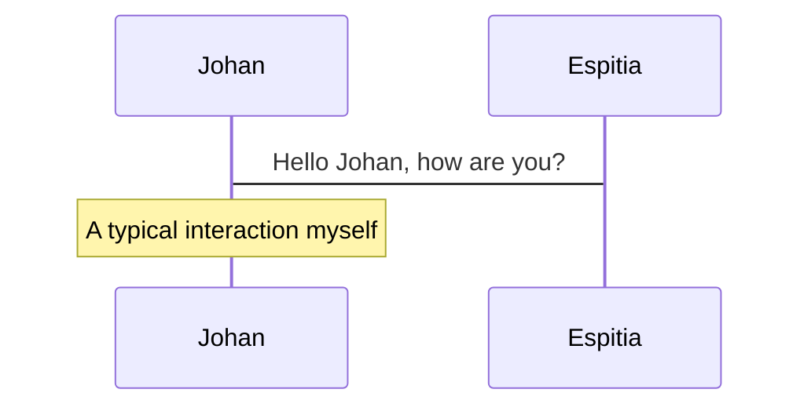
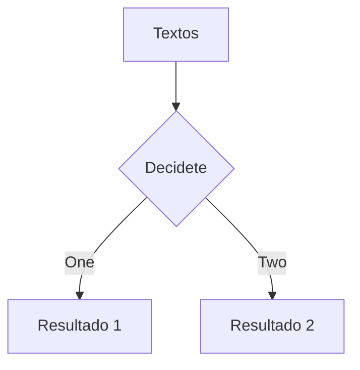

---
# try also 'default' to start simple
theme: seriph
# random image from a curated Unsplash collection by Anthony
# like them? see https://unsplash.com/collections/94734566/slidev
background: https://source.unsplash.com/collection/94734566/1920x1080
# apply any windi css classes to the current slide
class: 'text-center'
# https://sli.dev/custom/highlighters.html
highlighter: shiki
# show line numbers in code blocks
lineNumbers: false
# some information about the slides, markdown enabled
info: |
  ## Slidev Starter Template
  Presentation slides for developers.

  Learn more at [Sli.dev](https://sli.dev)
# persist drawings in exports and build
drawings:
  persist: false
# use UnoCSS (experimental)
css: unocss
wakeLock: "build"
---

# Welcome to Portafolio Experimental

Presentación de slides para portafolios geniales

<div class="pt-12">
  <span @click="$slidev.nav.next" class="px-2 py-1 rounded cursor-pointer" hover="bg-white bg-opacity-10">
    Presionar barra Spaciadora para avanzar <carbon:arrow-right class="inline"/>
  </span>
</div>

<div class="abs-br m-6 flex gap-2">
  <button @click="$slidev.nav.openInEditor()" title="Open in Editor" class="text-xl icon-btn opacity-50 !border-none !hover:text-white">
    <carbon:edit />
  </button>
  <a href="https://github.com/slidevjs/slidev" target="_blank" alt="GitHub"
    class="text-xl icon-btn opacity-50 !border-none !hover:text-white">
    <carbon-logo-github />
  </a>
</div>

<!--
The last comment block of each slide will be treated as slide notes. It will be visible and editable in Presenter Mode along with the slide. [Read more in the docs](https://sli.dev/guide/syntax.html#notes)
-->

---

# Te preguntaras ¿Que es un Slide?

Slide es hacer un deslizador and presentar un mejor diseño a los desarrolladores, consiste of the following features de esta manera:

- 📝 **Text-based** - Enfocate en el content with Markdown, and después style para luego
- 🎨 **Themable** - theme pueda ser shared (compartido) and used con npm packages (descargas de paquetes npm)
- 🧑‍💻 **Developer Friendly** - code highlighting, live coding with autocompletion (Esto se ve mucho en VSC)
- 🤹 **Interactive** - embedding Vue components to enhance your expressions= Mejor exp. de users
- 🎥 **Recording** - built-in recording and camera view (Opcional)
- 📤 **Portable** - export into PDF, PNGs, or even a hostable SPA (Adaptabilidad)
- 🛠 **Hackable** - anything possible on a webpage (Recomendación del following de ZTA)

<br>
<br>

Referencias: Para leer más about [Por que Slide?](https://sli.dev/guide/why)

<!--
You can have `style` tag in markdown to override the style for the current page.
Learn more: https://sli.dev/guide/syntax#embedded-styles
-->

<style>
h1 {
  background-color: #2B90B6;
  background-image: linear-gradient(45deg, #4EC5D4 10%, #146b8c 20%);
  background-size: 100%;
  -webkit-background-clip: text;
  -moz-background-clip: text;
  -webkit-text-fill-color: transparent;
  -moz-text-fill-color: transparent;
}
</style>

---

# Para poder interactuar al navegar

Precionar el botón de la izquierda que veras en tu teclado del control de navegación panel, [Comprender more](https://sli.dev/guide/navigation.html)

### Keyboard Shortcuts (Atajos con el teclado)

|     |     |
| --- | --- |
| <kbd>Flecha hacia la derecha</kbd> / <kbd>Barra space</kbd>| Da lugar a la siguiente animation or desplazamiento (Slide) |
| <kbd>Flecha hacía la izquierda</kbd>  / <kbd>or tecla shift</kbd><kbd>con barra space</kbd> | Regresar a la (previous) animation anterior or slide |
| <kbd>Flecha hacía up</kbd> | (Regresar) previous slide |
| <kbd>Flecha hacía down</kbd> | (Siguiente) next slide |

<!-- https://sli.dev/guide/animations.html#click-animations -->

<p v-after class="absolute bottom-23 left-45 opacity-30 transform -rotate-10">O en precionar las flechas correspondientes Here!</p>

---
layout: image-right
image: https://source.unsplash.com/collection/94734566/1920x1080
---

# Code's

El Uso de code's snippets and get the highlighting directanmente para recopilar algunos datos con consentimiento para seguir con el código de ética. ![^1]

```ts {all|2|1-6|9|all}
interface Usuario {
  id: numeros
  firstName: string "Letras"
  lastName: string
  role: string
}

function updateUsuario(id: number, update: Usuario) {
  const user = getUsuario(id)
  const newUsuario = { ...usuario, ...update }
  saveUsuario(id, newUsuario)
}
```

<arrow v-click="3" x1="400" y1="420" x2="230" y2="330" color="#564" width="3" arrowSize="1" />

[^1]: [Para saber More](https://sli.dev/guide/syntax.html#line-highlighting)

<style>
.footnotes-sep {
  @apply mt-20 opacity-10;
}
.footnotes {
  @apply text-sm opacity-75;
}
.footnote-backref {
  display: none;
}
</style>

---

# Para algunos Conponentes

<div grid="~ cols-2 gap-4">
<div>

Podemos usar Vue como components directly para ingresar nuestros slides.

Es de recordar que We have provided a few built-in components like `<Tweet/>` y `<Youtube/>` that you can use directly. And adding your decorar con components is also super easy peacy and then look like.

```html
<Counter :count="17" />
```

<!-- ./components/Counter.vue -->
<Counter :count="17" m="t-4" />

Checkea lo [Estas guías](https://sli.dev/builtin/components.html) para more.

</div>
<div>

```html
<Tweet id="1390115482657726468" />
```

<Tweet id="1390115482657726468" scale="0.67" />

</div>
</div>


---
class: px-20
---

# Temas llamativos

Los deslizables comes with powerful theming support. Themes can provide styles, layouts, components, o even configurations for tools (herramientas "frameworks"). Switching between temas by just **_one edit_** in your frontmatter:

<div grid="~ cols-2 gap-2" m="-t-2">

```yaml
---
tema_por: default
---
```

```yaml
---
tema_mejor: seriph
---
```


</div>

Leer more sobre [Como usar a theme](https://sli.dev/themes/use.html) and
checkea los [Awesome Themes Gallery 💯 :3 ](https://sli.dev/themes/gallery.html).

---
preload: false
---

# Animaciones

Las Animations son powered por [@vueuse/motion](https://motion.vueuse.org/) Ya que se verían de esta manera: .

```html
<div
  v-motion
  :initial="{ x: -80 }"
  :enter="{ x: 0 }">
  Slidev
</div>
```

<div class="w-60 relative mt-6">
  <div class="relative w-40 h-40">
    
    
    
  </div>

  <div
    class="text-5xl absolute top-14 left-40 text-[#2B90B6] -z-1"
    v-motion
    :initial="{ x: -80, opacity: 0}"
    :enter="{ x: 0, opacity: 1, transition: { delay: 2000, duration: 1000 } }">
    Slidev
  </div>
</div>

<!-- vue script setup scripts can be directly used in markdown, and will only affects current page -->
<script setup lang="ts">
const final = {
  x: 0,
  y: 0,
  rotate: 0,
  scale: 1,
  transition: {
    type: 'spring',
    damping: 10,
    stiffness: 20,
    mass: 2
  }
}
</script>

<div
  v-motion
  :initial="{ x:35, y: 40, opacity: 0}"
  :enter="{ y: 0, opacity: 1, transition: { delay: 3500 } }">

[ More](https://sli.dev/guide/animations.html#motion)

</div>

---

# LaTeX (Matricial Lineal)

LaTeX is supported out-of-box powered by [KaTeX](https://katex.org/).

<br>

Inline $\sqrt{3x-1}+(1+x)^2$

Block
$$
\begin{array}{c}

\nabla \times \vec{\mathbf{B}} -\, \frac1c\, \frac{\partial\vec{\mathbf{E}}}{\partial t} &
= \frac{4\pi}{c}\vec{\mathbf{j}}    \nabla \cdot \vec{\mathbf{E}} & = 4 \pi \rho \\

\nabla \times \vec{\mathbf{E}}\, +\, \frac1c\, \frac{\partial\vec{\mathbf{B}}}{\partial t} & = \vec{\mathbf{0}} \\

\nabla \cdot \vec{\mathbf{B}} & = 0

\end{array}
$$

<br>

[Aprender more sober colocación de ecuaciones](https://sli.dev/guide/syntax#latex)

---

# Diagramas UML entre other's

Podemos create diagrams / graphs from textual descriptions, directly in your Markdown.

<div class="grid grid-cols-3 gap-10 pt-4 -mb-6">





```plantuml {scale: 0.7}
@startuml

package "Algun grupo" {
  HTTP - [First Componente]
  [Another Componente]
}

node "Other Groups" {
  FTP - [Second Componente]
  [First Componente] --> FTP
}

cloud {
  [Ejemplo 1]
}


Base de datos "MySql" {
  folder "Este es nuestro folder" {
    [Folder :3]
  }
  frame "Foo" {
    [Frame 4]
  }
}


[Another Componente] --> [Example 1]
[Ejemplo 1] --> [Folder 3]
[Folder 3] --> [Frame 4]

@enduml
```

</div>

[Aprende More](https://sli.dev/guide/syntax.html#diagrams)


---
layout: center
class: text-center
---

# Si quieres learn More

[Haz Click en Documentations](https://sli.dev) · [GitHub](https://github.com/slidevjs/slidev) · [ • Mostras Más Casos •](https://sli.dev/showcases.html)
